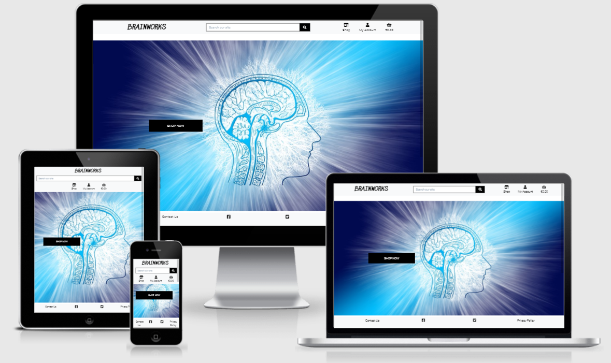
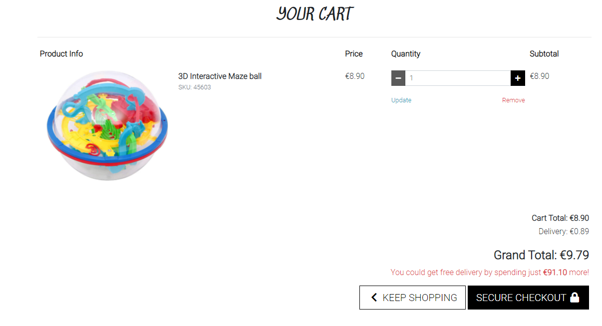
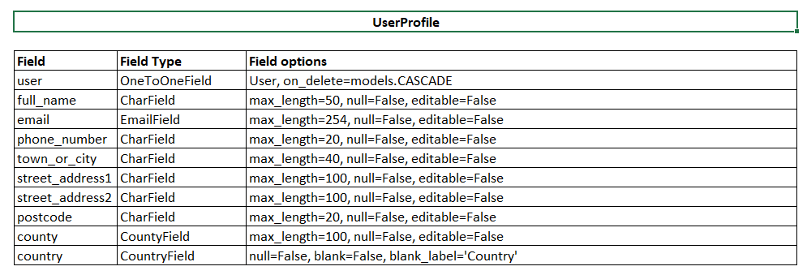

# Brainworks

## Project 5 - E-Commerce Applications

The aim of this project was to build a Full-Stack site based on business logic used to control a centrally-owned dataset. This includes setting up an authentication mechanism and providing the ability to make purchases.

Brainworks sells brain teaser puzzles and books games to the general public. They cater for all age groups and have a wide variety to choose from.

The live site can be found <a href="https://michelle-brainworks.herokuapp.com/" target="_blank" rel="noopener">here</a>. (Note: Right click on link to open a new tab).

# Table of Contents
1. [UX](https://github.com/Michelle3334/brainworks#ux)
    * [Website owner goals](https://github.com/Michelle3334/brainworks#website-owner-business-goals)
    * [User stories](https://github.com/Michelle3334/brainworks#user-stories)
    * [Wireframes](https://github.com/Michelle3334/brainworks#wireframes)
    * [Design](https://github.com/Michelle3334/brainworks#design)
    * [Marketing](https://github.com/Michelle3334/brainworks#marketing)
2. [Features](https://github.com/Michelle3334/brainworks#features)
3. [Database Schema](https://github.com/Michelle3334/brainworks#database-schema)
4. [Technologies Used](https://github.com/Michelle3334/brainworks#technologies-used)
5. [Testing](https://github.com/Michelle3334/brainworks#testing)
    * [Functionality testing](https://github.com/Michelle3334/brainworks#functionality-testing)
    * [Code Validation](https://github.com/Michelle3334/brainworks#code-validation)
    * [Compatibility testing](https://github.com/Michelle3334/brainworks#compatibility-testing)
    * [Performance testing](https://github.com/Michelle3334/brainworks#performance-testing)
    * [User stories testing](https://github.com/Michelle3334/brainworks#user-stories-testing)
    * [Bugs](https://github.com/Michelle3334/brainworks#bugs)
6. [Deployment](https://github.com/Michelle3334/brainworks#deployment)
7. [Credits](https://github.com/Michelle3334/brainworks#credits)
8. [Acknowledgments](https://github.com/Michelle3334/brainworks#acknowledgements)

# UX
## Website owner business goals
Website owner goals were tracked using github projects kanban board.
* I would like to be able to add a product to the store.
* I would like to be able to delete a product from the store.
* I would like to be able to edit a product.
* I would like to be able to add a blog to captivate and interest visitors. 

## User Stories
User story goals were tracked using github projects kanban board.
### New user goals:
* I would like to be able to view a list of products.
* I would like to view information about individual products.
* I would like to be able to register for an account.
* I would like email confirmation after registering for an account.
* I would like to be able to get in contact with the website owner.
* I would like to be able to view a list of blogs to choose which one I would like to read more about.
* I would like to be able to view the comments made on the blogs by other users.
* I would like to be able to view others opinions on the products.
### Returning user goals:
* I would like to be able to login or logout.
* I would like to be able to recover my lost password.
* I would like to have a personalised profile to view order history and amend my details.
* I would like to be able to sort or filter products.
* I would like to be able to search for a product.
* I would like to be able to select and adjust a quantity of an item to purchase.
* I would like to view the items in my shopping cart.
* I would like to view the order confirmation after checking out.
* I would like to receive an email confirmation after placing an order.
* I would like to be able to view individual blogs and add comments.
* I would like to be able to leave a review for a product.

[Back to Table of Contents](https://github.com/Michelle3334/brainworks#table-of-contents)

## Wireframes
I used Balsamiq to create the wireframes. The brainteaser section was left out of the final website due to time constraints. There are some minor changes made to the layout during the development process.

### Desktop view
* Home page 

* Contact

* Products

* Product detail

* Brainteasers:

* Sign In

* Register

* Profile

* Cart

* Checkout

* Blog

### Mobile view
* Home page

* Contact 

* Products

* Product detail

* Brainteasers:

* Sign In

* Register

* Profile

* Cart

* Checkout

* Blog

[Back to Table of Contents](https://github.com/Michelle3334/brainworks#table-of-contents)

## Design
### Fonts
Sedgwick+Ave is used for the logo, with Roboto as the main font for all other text. Sans-Serif is used as the backup font. 

## Marketing
* Keywords have been included in the meta keywords in the base.html.
* Links to other websites have been included on the Home page.
* Sign up forms have been created which appear as a pop up when the user first loads the website. There is also a link to sign up when sending filling in the contact request form.
* Facebook and Twitter pages were created.

    **Facebook page**
    
    

    **Twitter page**
    

[Back to Table of Contents](https://github.com/Michelle3334/brainworks#table-of-contents)

# Features
## Existing Features
### Navigation Bar
The navigation bar has links to the shop, account, shopping cart and blog posts. If clicked, the logo takes the user back to the home page.
  
    
### Products
The user can get to the products section by clicking on the shop icon on the nav bar, they can either select to view all products or select a category.

### Item view
If users click on an item they can view further details and select to add the item to the shopping cart.

### Product review
Users can view the reviews on products left by other users, if logged in then the user can leave a review on a product.

### Contact
The user can contact the website via a link provided in the footer which is accessible on every page. It opens in a separate web page. The user also has an option to sign up to the newsletter.
When the user first lands on the page there will be a pop up which asks if they would like to sign up to the newsletter. They can close the pop up and continue viewing the site.

### Profile page
If the user is logged in they are able to view and update their profile information as well as view their order history.

### Shopping cart
In the shopping cart the user can view, update or delete items. If they have finished selecting items to purchase they can go to the secure checkout section.

### Checkout
When the user clicks to checkout they can complete their delivery information and select to save it to their profile if logged in. 

### Blog
The user can view all the blogs that have are available for viewing. If they click on an individual blog they can read the full article and view any comments that have been made.
Only logged in users are able to add new comments.

### 404 error page
If the user encounters a 404 error they will see a custom page and a link to redirect to the home page.

### Privacy
The website has a privacy policy which is accessible from the footer on every page. When clicked it opens in a new tab.

## Future features
* A brainteaser page with fun riddles as well as the option to view the answers to the riddles.

[Back to Table of Contents](https://github.com/Michelle3334/brainworks#table-of-contents)

# Database Schema

### DBM flow
My database schema was initially built in excel and then built using the online tool dbdiagram.io. The schema is as follows:

### User Profile model
* Django's user and admin model was utilised, with some modifications for the user profile display and update.

### Products app

### Product review

### Cart app

### Blog app

# Technologies Used:
### Programming Languages:
* CSS, HTML, Javascript, Python and Django.
### Database framework
* Postgres.
### Git
* Git was used for version control by utilizing the Gitpod terminal to commit to Git and Push to GitHub.
### Github
* GitHub was used to store the projects code after being pushed from Git.
### Bootstrap
* Bootstrap was used to for design and to make the website responsive.
### Balsamiq
* Balsamiq was used to create the wireframes during the design process.
### Google Fonts
* Google Fonts was used to import fonts.
### Font Awesome
* Font Awesome was used to add icons for design and UX purposes.
### Stripe
* Stripe was used for payment and authentication.
### AWS
* AWS was used to store static and media files.
### MailChimp
* MailChimp was used for the contact us form and to subscribe to the newsletter.

[Back to Table of Contents](https://github.com/Michelle3334/brainworks#table-of-contents)

# Testing
## Functionality Testing
* I used Google Chrome developer tools throughout the development process for testing and solving problems with style and display issues.
* I used Github Project and Issues to track tasks. After each task completion, I would fully test it before moving on to the next task.
* All links were tested multiple times during the development process and again once the project was completed to ensure that all pages were linked correctly.
* All Forms and form elements were tested to ensure that they work as they should, with user feedback on errors as well as user feedback on successful submission.
* Tested every functionality like Stripe, add/edit/delete products, contact, check out, and confirmation email with no errors found.

Manual Unit testing summary is as follows (this is not an exhaustive list of all the tests performed during development but a simple summary of the basic tests):

| Test        | Expected | Outcome  |
| ------------- |------------| ---------|
| Information and error messages | User receives error or information messages when logging in, logging out, adding item to cart, editing or removing item and when submitting forms | Passed |
| User login, register and login | User can register, login or logout and all pages display without error | Passed | 
| User register | User registers and receives an email to verify their email address | Passed |
| Cart view | Test the cart view page loads successfully and displays items added to cart | Passed |
| Edit Cart | User can increase or decrease amount of item | Passed |
| Remove item from Cart | User can delete an item from cart and cart updates, if no items in cart then appropriate message displays on the screen | Passed |
| Checkout success | Test successful checkout and confirmation message | Passed |
| Checkout update info | Test info updated if user logged in and checkbox ticked | Passed |
| Invalid information in payment form | User receives an error message with detail of error | Passed |
| Links open in new tab | All links open in a new tab so user does not have to use the back button on the browser | Passed |
| Super user | Product management link under Account (to add a new product) only viewed when super user logged in, edit and delete links for existing products only display for super user | Passed |
| Search bar | User can freetype in search bar and the relevant entries display, if no input is made then error message displays | Passed |
| Add comment | Logged in User can type a comment on a blog and on submit it adds the comment to the list of comments | Passed |
| Add review | Logged in User can add a review to a specific product and on submit it adds the review to the list of reviews | Passed |

## Code Validation
**1. CSS Validation using <a href="https://jigsaw.w3.org/css-validator/#validate_by_input" target="_blank" rel="noopener">W3C CSS Validator Services</a>.**

**2. <a href="http://pep8online.com/">PEP8</a> was used to test the Python code**

**3. <a href="https://beautifytools.com/javascript-validator.php">Beautify Tools</a> was used to test the Javascript snippets.**

[Back to Table of Contents](https://github.com/Michelle3334/brainworks#table-of-contents)

## Compatibility Testing
* The website was tested on Google Chrome, and Samsung cellphones.
* The website was viewed on a variety of device sizes such as Desktop, Samsung S10, Samsung tablet and Iphone 11, I also used the responsive function when inspecting the pages to view various sizes. 

## Performance testing
I ran the Lighthouse tool to check performance of the website. The performance on the products page is as expected for a page with a lot of images to display.
Screenshots of the final test are presented below:
* Desktop
    * Home page
    
    
    * Products
    
    

* Mobile
    * Home page
    
    
    * Products
    
 

[Back to Table of Contents](https://github.com/Michelle3334/brainworks#table-of-contents)

## User Stories testing

### New user goals
1. I would like to be able to view the products.
    * Users can view the products by clicking on the shop icon and selecting from the dropdown.
2. I would like to view information about individual products.
    * Users can view information about an individual product by clicking on the product from the products page.
3. I would like to be able to register for an account.
    * Users can register by clicking on the My Account icon in the nav bar.
4. I would like email confirmation after registering for an account.
    * Users will receive an email confirming and asking them to verify their email address.
5. I would like to be able to get in contact with the website owner.
    * Users can get in contact view the Contact us link in the footer on each page, there is also another link on the home page.
6. I would like to view a list of the blogs.
    * Users can click on the link in the nav bar and view all the blogs.
7. I would like to view comments made by users on the blog.
    * The user can view comments on a blog if they click on the individual blog and scroll to the bottom of the article.

### Returning user goals:
1. I would like to be able to login or logout.
    * Users can login or logout from the Account icon in the nav bar.
2. I would like to be able to recover my lost password.
    * Users can recover their lost password from a link on the sign in page.
3. I would like to have a personalised profile to view order history and amend my details.
    * Users can view their order history or amend details on the Profile page accesible from the Account dropdown.
4. I would like to be able to sort or filter products.
    * Users can sort or filter products on the product page.
5. I would like to be able to search for a product.
    * Users can search for a product using the search bar at the top of each page in the navigation.
6. would like to be able to select and adjust a quantity of an item to purchase.
    * Users can adjust the quantity from the Shopping cart page.
7. I would like to view the items in my shopping cart.
    * Users can view items in the shopping cart by clicking on the cart icon in the nav bar.
8. I would like to view the order confirmation after checking out.
    * Users can view the order confirmation after checking out, if they are logged in then they can also view their order history from their profile page.
9. I would like to receive an email confirmation after placing an order.
    * Users will receive an email confirmation after placing an order.
10. I would like to be able to view and add comments.
    * A logged in user can both view and add new comments to a blog.

### As a website owner:
1. I would like to be able to add a product to the store.
    * The website owner can add a product via the store management link under My Account, it is only available to a super user.
2. I would like to be able to delete a product from the store.
    * If the website owner is logged in they will find a link under each product in order to delete that product.
3. I would like to be able to edit a product.
    * If the website owner is logged in they will find a link under each product in order to edit that product.
4. I would like to be able to add a blog.
    * The site owner can add a blog via the django admin module.

[Back to Table of Contents](https://github.com/Michelle3334/brainworks#table-of-contents)

# Deployment
The project was deployed to GitHub Pages using the following steps, I used Gitpod as a development environment where I commited all changes to git version control system. I used the push command in Gitpod to save changes into GitHub.

### Deployment to Heroku
Before creating a Heroku app make sure your project has these two files:

* requirements.txt - You can create one by using <code>pip3 freeze > requirements.txt</code>
* Procfile - You can create one by using echo web: <code>python run.py > Procfile</code>

### Create application:

1. Navigate to Heroku's site <a href="https://id.heroku.com/login" target="_blank" rel="noopener">here</a>. (Note: Right click on link to open a new tab).
2. Register and/or Login as applicable.
3. Click on the new button in the top right and select "Create new app".
4. Enter the app name and region closest to you.
5. Click the create app button.

### Set environment variables:

1. Click on the settings tab and then click "Reveal config vars".

2. Config variables added throughout project:
(add image of variables)

### Setting up database in deployment

1. Temporarily add the <code>DATABASE_URL</code> to <code>settings.py</code>:

    <code>DATABASES = {
'default': dj_database_url.parse('your_postgres_database_url')
}</code>

2. Migrate the data from development to production version.

    * To migrate the database models in the project to the Postgres database you can use the following command:

    <code>python3 manage.py migrate</code>

3. You will then need a superuser for the Postgres database too. To create one you can use the following command:

    <code>python3 manage.py createsuperuser</code>

4. Remove the Postgres database URL from settings.py as this should not in any case be deployed to GitHub for security reasons.

6. To connect your Heroku app to be deployed from a Github repository, you can follow these steps:

    * Open the heroku app page on the deploy tab and select GitHub - Connect to GitHub.
    * Sign into GitHub if not already.
    * A prompt to find a Github repository to connect to will then be displayed.
    * Enter the repository name for the project and click search.
    * Once the repository has been found, click the connect button.
6. Once you have your GitHub repository connected, without leaving deploy tab:

    * Under Automatic deploys section, choose the branch you want to deploy from and then click the "Enable Automatic Deploys" button.
    * To deploy your app to Heroku click the "Deploy Branch" button.

### Amazon Web Services:
All Static and media files for the deployed version of the site are hosted in a Amazon Web Services(AWS) S3 bucket. In order to create your own bucket, please follow the instructions on the AWS website.

1. In the gitpod terminal, install boto3 and django-storages using the following commands: <code>pip3 install boto3</code> and <code>pip3 install django-storages</code>,
2. Freeze the new requirements into the 'requirements.txt' file using the <code>pip3 freeze > requirements.txt</code> command.
3. Add 'storages' to INSTALLED_APPS in settings.py.
4. Add code to settings.py in order to link the AWS bucket to the website.
5. Create a custom_storages.py file in the root level of the project. Inside it, include the locations of the Static Storage and Media Storage.
6. Delete DISABLE_COLLECTSTATIC from the Heroku Config Variables.
7. Finally, push to GitHub, and all changes should be automatically pushed to Heroku too.

[Back to Table of Contents](https://github.com/Michelle3334/brainworks#table-of-contents)

# Credits
## Code
* I followed the course content modules for Boutique Ado while writing the code for the cart functionality, Stripe and Webhooks.

## Content
* All product information and images was sourced from:
    * <a href="https://amazon.com/">Amazon</a>
    * <a href="https://ebay.com/">E-Bay</a>
    * <a href="https://walmart.com/">Walmart</a>
    * <a href="https://www.etsy.com/">Etsy</a>
* The information for the blogs was sourced from:
    * <a href="https://info.thinkfun.com/stem-education?src=HPicon">Think Fun</a>
    

## Media
The hero image on the home pages and images for the blogs were sourced from:
* <a href="https://pixabay.com/">Pixabay</a>

## Acknowledgements
* My mentor for support, advice and feedback.
* The students on Slack for peer review and comments.
* Code Institute Tutor support for help with coding issues.
* My family and friends for their support, feedback and testing.

[Back to Table of Contents](https://github.com/Michelle3334/brainworks#table-of-contents)